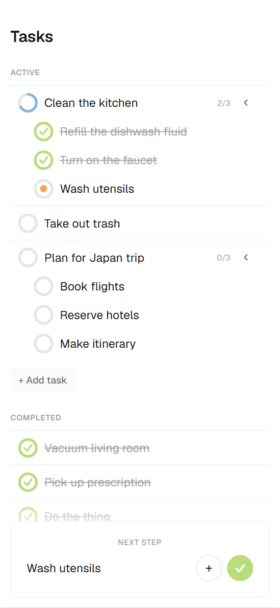

## Next — A simpler task manager

There are many task managers help you organize work. Next focuses on the hardest
part: getting started. Big tasks (clean the apartment, plan a trip) create
uncertainty about where to begin, which leads to procrastination — often not
from a lack of motivation, but from the absence of a clear first step. This
is especially true for people with ADHD, anxiety, or other causes of
executive dysfunction.

Next's answer: any task can be divided into a smaller one. Keep dividing
until the next step feels almost impossible to avoid — by hand, or with
Claude proposing a breakdown — and Next always surfaces that one next action
instead of a wall of to-dos, rolling progress up the tree as subtasks get
checked off.

## Stack

- Next.js 16 (App Router) + TypeScript + CSS Modules
- Prisma 7 (driver adapter: `@prisma/adapter-pg`) + PostgreSQL
- Claude API (`@anthropic-ai/sdk`) for the "Break Down" feature
- Fractional indexing (`fractional-indexing`) for task ordering — see `src/lib/order.ts`

## Project structure

- `prisma/schema.prisma` — data model (User, Project, Task)
- `prisma/seed.ts` — seeds a demo project
- `src/lib/task-tree.ts` — builds the task tree and finds the "Next Action"
- `src/lib/order.ts` — fractional-index helpers for sibling ordering
- `src/lib/anthropic.ts` — Claude API call for task breakdown
- `src/app/api/**` — REST-ish route handlers (projects, tasks, reorder, breakdown)
- `src/components/TaskApp.tsx` — client-side state + orchestration
- `src/components/TaskRow.tsx` — recursive task tree row
- `src/components/NextActionCard.tsx` — the "Next Action" surface
